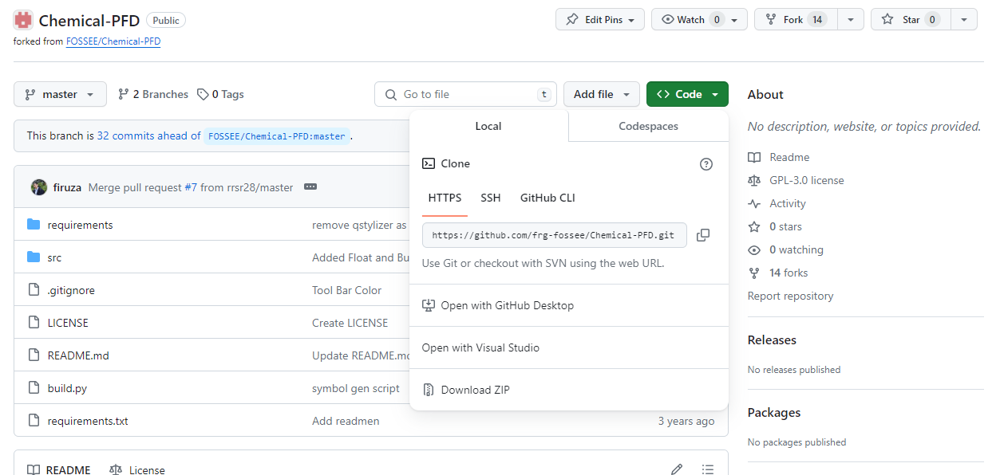
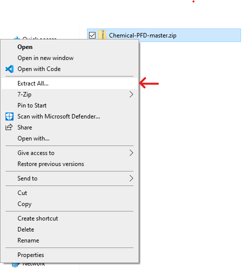

# PFD Tool (Installation Windows)

Installation steps for Windows 

## Step 1 (Installing Python)

* Any version of Python 3 will be acceptable to run this software.
* We have used [Python 3.6.8](https://www.python.org/downloads/release/python-368/)
* Download the exe file
* While installing please make sure to check the ```Add Python to PATH``` option in the installation window as shown below.


## Step 2 (Downloading the code)

* After successfully installing Python, you need to download the code.
* Click [here](https://github.com/frg-fossee/Chemical-PFD) to view
* Click the green color Code button and click Download ZIP as shown in the figure given below




## Step 3 (Run the Project)

* If you are reading this then first of all, CONGRATULATIONS!! 🎉🎉
* For this last step, all you need to do is extract the zip file



* Open the folder and run WindowsRunMe.bat file.

* And you are ready to roll ✌🤘
